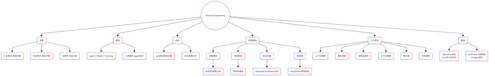

# 引言：你的客厅里来了一条龙

想象一下：2026年2月，你的客厅里来了一条龙。它聪明、强大，目前看起来还算温顺。但龙会长大——你能驾驭它吗？

这不是比喻，OpenAI 在 2026 年 2 月发表了一篇名为《Harness Engineering: Leveraging Codex in an Agent-First World》的技术博客，披露了一个惊人的实验：一个仅由 3 名工程师（后扩展到 7 人）组成的团队，在 5 个月内用 Codex Agent 生成了超过 100 万行生产级代码，合并了约 1500 个 Pull Request，没有一行代码是人类手写的。

真正引爆行业讨论的，不是"AI 写了 100 万行代码"这个数字本身，而是它提出的一个全新工程范式：**Harness Engineering（驾驭工程）**。

---

## 1、什么是 Harness Engineering？

**Harness** 一词来源于马具。

- **马**是强大的 AI 模型，但因其黑盒属性具有不可控性；
- **Harness** 是指缰绳、马鞍和护具等，是工程管理学；
- **骑手**是人类工程师，明确意图、设计环境和构建反馈回路；

**Agent = Model + Harness** —— 如果你不是模型本身，你就是 Harness。

一个原始的大语言模型不是 Agent。但当 Harness 赋予了它状态、工具执行、反馈回路和可强制执行的约束时，它就变成了一个能完成复杂任务的智能体。

**Harness 包含但不限于：**

- System Prompts（系统提示词）
- Tools, Skills, MCPs（工具、技能、模型上下文协议）
- Bundled Infrastructure（bundled 基础设施：文件系统、沙箱、浏览器）
- Orchestration Logic（编排逻辑：子 Agent 生成、交接、模型路由）
- Hooks/Middleware（钩子/中间件：用于确定性执行的压缩、继续、lint 检查）

---

为了深刻理解 Harness Engineering，让我们把视野拉长到更宏大的技术史尺度上：

<!-- 图片：可放入 images/ 后改为  -->

1. **工业革命：驾驭物理力量**  
   蒸汽机释放了远超人类肌肉的物理力量。但蒸汽机本身不知道该驱动什么、转多快、何时停。于是，人类发明了飞轮调速器、安全阀、传动系统等，这些就是工业革命时代的"Harness"。没有这些，蒸汽机只是一个危险的热水壶。

2. **信息革命：驾驭计算力量**  
   计算机释放了远超人类大脑的计算力量。但裸机不知道该算什么。于是，人类发明了操作系统、编程语言、软件工程方法论，从瀑布模型到敏捷开发，从汇编到高级语言，每一步都是在构建更好的"Harness"来驾驭算力。

3. **AI 革命：驾驭认知力量**  
   大语言模型释放了远超人类个体的认知力量，它能自主规划、推理和生成。但模型本身不知道该解决什么问题、遵循什么约束、如何在真实世界中更可靠地运作。

| 阶段 | 时间 | 核心问题 |
|------|------|----------|
| Prompt Engineering | 2023-2024 | 如何让模型理解你的意图 |
| Context Engineering | 2025 | 如何给模型正确的知识边界 |
| Harness Engineering | 2026- | 如何让 Agent 可靠、持续、不失控 |

<!-- 图片：可放入 images/ 后改为  -->

Harness Engineering 的核心哲学用八个字概括：**"人类掌舵，Agent 执行"**。

---

## 2、Harness Engineering 为什么突然火了？

Harness Engineering 最近火起来，不是因为谁突然发明了一个新名词，而是因为原来的 LLM 用法开始碰到天花板。

任务短、一两步的时候，prompt + tool calling 还能对付；但一旦拉成长流程、多文件、多轮迭代、需要外部验证和持续记忆，问题就来了。

LangChain 把这件事说得很透：模型本身不自带 durable state（持久状态）、代码执行、外部知识访问和任务运行环境，所以很多"Agent 能力"其实都在模型外面，落在 Harness 这一层。

更关键的是，大家经过足够多的真实项目验证后，发现长任务里最容易出问题的不是单步生成，而是上下文越来越乱、模型越来越自信、任务越来越偏航。于是大家开始认真研究"长时任务 Harness"该怎么设计，而不是只靠 prompt 调教。

Harness Engineering 之所以火，根本原因是：**模型越强，系统层的短板就越明显。**

<!-- 图片：可放入 images/ 后改为  -->

<!-- 图片：可放入 images/ 后改为  -->

## 3、架构：从"记事本"到"管理制度"的跃迁

Harness 的本质是一套围绕大语言模型建立的工业级管理系统。理解它的关键，是看清它如何一层层补上模型的固有缺陷。这个三层体系不是凭空设计出来的，而是从一次又一次惨烈的失败中逼出来的。每一层都对应着一段"血泪史"。

| 层级 | 核心问题 | 目标 |
|------|----------|------|
| **第一层：流程管控** | Agent 不按清单干活、失忆、提前交卷 | 让 Agent 能稳定跑完长流程 |
| **第二层：并发控制** | 多 Agent 协作混乱、互相覆盖、效率塌陷 | 让群体智能高效有序 |
| **第三层：验证纠偏** | Agent 自我评估偏差、盲目自信、篡改测试 | 戳破 AI 的自我欺骗，确保结果真实可靠 |

---

### 3.1、第一层：流程管控 —— 从"记事本"到"管理制度"

**核心问题：** Agent 经常虚标完成、提前交卷、失忆、走弯路。这不是"教得不够好"，而是制度缺位。

**演进史：Context Engineering 的极限**

2024 年底到 2025 年，业界主攻的方向是 Context Engineering（上下文工程），核心思路是"给 Agent 更好的记事本"：

- **阶段一：记忆外化（AutoGPT 2023.03）**  
  给模型发空白本子（write_to_file + read_file），载体是纯 .txt 文件，没有任何结构约束。
- **阶段二：结构化面板（Devin 2024.03）**  
  引入可视化的进度条，每一步有明确状态标记。
- **阶段三：CLAUDE.md + Scratchpad（Claude Code 2025.02）**  
  项目级指令文件 + 草稿本，成为业界标准范式。

但即使有了外部化记忆系统，长任务依然跑不通。Anthropic 在 2025 年 5 月做了一次致命实验：让 Claude 从零写一个完整的 Web 应用。结果全面溃败，发现了四种失败模式：

| 失败模式 | 现象 | 根本原因 |
|----------|------|----------|
| 提前交卷 | 做了三个功能就宣布"项目完成" | 看到已有代码量，以为活儿干完了 |
| 环境盲区 | 代码写出来跑不起来，自己不知道 | 缺乏外部验证通道 |
| 虚标完成 | 功能清单标了 done，实际功能是坏的 | 单元测试通过但端到端失败 |
| 失忆实习生 | 每轮新 Session 花大量 Token 重新摸项目结构 | 上下文窗口不够，记忆不连续 |

**核心洞察：** Context Engineering 解决的只是"存不住"的问题。但金鱼的毛病远不止存不住——它有时候不翻本子，翻了也不按本子做，做完还没人验收。

这个认知跃迁，让 Anthropic 的应对方式从"做一个更好的记事本"彻底转向了"围绕严格遵守工作流程，构筑一整套管理制度"。

**方案一：JSON 物理锁（防虚标完成）**  
在项目开始时，由一个专门的「初始化 Agent」生成一份完整的功能清单，用 JSON 结构（机器可读、不可篡改）存储。真正干活的「编码 Agent」只能改一个字段标「通过」或「不通过」的严格死流程。

**方案二：三步唤醒仪式（防失忆）**  
每个 Session 开头强制执行，像工厂换班时翻交接簿：

1. `pwd` —— 确认当前目录
2. `git log` —— 查看代码改动历史
3. `progress.txt` —— 查看下一个任务

效果：Agent 能连续跑几个小时。每一轮只做一件事，做完提交，状态外化到进度文件里。下一轮进来，读最新的 progress.txt 就知道该干什么。

**方案三：Git 存档（防死胡同）**  
每一次代码改动都通过 Git 存档。一旦模型陷入死胡同，直接用 `git revert` 把代码库回滚到上一个能跑的干净状态，然后重新唤醒模型。

设计哲学：不指望金鱼自己撤销错误。直接给它一台时间机器。

**方案四：Context Reset（管脑容量）**  
当历史消息撑爆上下文窗口时，Harness 会彻底清空 Agent 的"脑子"，启动一个全新的 Agent，通过一份结构化的交接文件把前一轮的状态和下一步任务传过去。

Anthropic 把这个叫 Context Reset —— 不是压缩记忆，是直接换一条新金鱼，只给它一张写好的交接单。

---

### 3.2、第一层的进化：OpenAI 的"仓库即现实"补丁

Anthropic 的管理制度管的是流程——让 Agent 必须打卡、翻本子、按清单干活。

但 OpenAI 在《Harness engineering: leveraging Codex in an agent-first world》（2026.02）中提出了一个更彻底的认知：**仓库即现实（Repo-as-truth）**。

从 Agent 的角度看，它在运行时无法访问的东西，就是不存在的。Slack 上的讨论不存在，团队脑子里的共识不存在，Google Docs 里的方案不存在。唯一存在的，是代码仓库里那些版本化的、Agent 能直接读到的文件。

这意味着：如果你想让 Agent 知道一件事，只有一个办法——**写进仓库**。

- 架构决策要写进去
- 设计原则要写进去
- 质量标准要写进去
- 连"我们团队偏好什么风格"都要写进去

OpenAI 的做法很具体：

- `AGENTS.md` 只有约 100 行，不是百科全书，是一份地图——只告诉 Agent 去哪里找更深的信息
- custom linter 规则挂在 CI 流水线上，Agent 每次提交代码都会被自动扫一遍
- Doc-gardening Agent 专职维护文档，扫到某篇文档和真实代码脱节就自动发起修改请求

**Repo-as-truth 的本质是一个管理哲学的升维：**

- Anthropic：流程管行为（必须打卡、翻本子）
- OpenAI：环境管认知（确保它感知到的整个世界都是准确的）

流程管住的是行为，环境管住的是认知。

到此，Agent 已经能稳定跑完长流程了。但单个 Agent 的能力有限，下一步自然会想：派更多 Agent 同时干活。

---

### 3.3、第二层：并发控制 —— 终结无政府状态

**核心问题：** 当单个 Agent 能稳定跑长任务后，应用层的贪婪立刻浮现——既然单台车能跑，为什么不能同时派出一百台车？

但现实是残酷的。没有管控的并发只会带来惨烈的连环车祸。

**失败案例一：20 个 Agent 的效率塌陷**  
Cursor 团队在《Scaling long-running autonomous coding》（2026.01）记录了扩大并发规模时的崩塌：

尝试让几百个 Agent 共享一份大型项目。20 个 Agent 同时工作时，有效吞吐量下降至仅相当于 2-3 个 Agent。锁机制成了瓶颈。更绝望的是，其余的 Agent 发现核心代码被占用了，为了显示自己还在工作，专门挑最简单、最无关紧要的代码去改——疯狂修改注释、调整空格和缩进。

几百个高智商 AI 瞬间陷入了纯粹的无政府状态。

**根因：** 模型缺乏自律和宏观协作常识，没有强制控制流，聪明的大脑只会用最快的速度把整个团队带进死胡同。

**失败案例二：16 个 Agent 的代码战争**  
Anthropic 在《Building a C compiler with a team of parallel Claudes》（2026.02）揭示了另一种算力极其昂贵的并发灾难：

派出 16 个顶配 Claude 实例并行写 C 编译器。初期各看各的模块，进度飞快。但一进入整体编译和链接阶段，全局错误出现。到了改 Bug 阶段，16 个 Agent 就像 16 个没有对讲机的瞎子，疯狂消耗算力，互相覆盖数百行代码。

**核心矛盾：** 任务需要全局协调时，缺乏沟通渠道的并行只会造成灾难。

**解决方案：强约束的编排引擎**

**方案一：状态机门控 + DAG 单行道**  
Cursor 用状态机搭建了 Planner（规划器）、Worker（执行器）、Judge（裁判）的三层阶级，并加强硬门控：

关键设计：

- **前置审批：** 长任务启动前，Agent 必须先提交完整计划、等待批准才能动手——这是第一道闸
- **过程报告：** 每个 Worker 提交结构化交接报告（工作总结、发现问题、偏离记录）
- **全局视野：** Planner 靠报告维持全局视野，发现偏移立即拉回

这个设计确保：**没有规划，不准执行；没有验收，不得通过。**

**方案二：二分查找法 + 标准参照**  
面对 16 个 Agent 互相覆盖的问题，Anthropic 引入了 GCC（业界最成熟的开源编译器）作为标准答案参照，用二分查找定位 Bug；不同 Agent 同时测试不同的文件子集，天然隔离工作范围，不会再互相踩脚。

**本质：** 引入外部权威（ground truth）作为仲裁者，避免 Agent 之间的无谓冲突。

---

### 3.4、第二层的进化：从"临时工"到"团队"

Claude Code 源码（51 万行）揭示了第二层的更高级形态：

**模式一：Coordinator（协调者模式）**

- 协调者：AgentTool、TaskStopTool、SendMessageTool、TeamCreate/Delete
- 关键约束：没有 Bash、Read、Write、Edit——协调者不写代码，只负责规划、委派、汇总
- 核心原则："永远不要委派理解"（Never Delegate Understanding）——协调者必须综合研究结果，提供精确的执行指令，而不是转发模糊的任务描述

**模式二：Team/Swarm（团队模式）**

- 成员不是"临时工"，而是长期驻扎的队友——完成任务后进入 idle 状态，等待新任务
- 有自己独立的上下文窗口、Git 工作区、记忆存储
- 支持点对点通信（SendMessageTool），前端 Agent 可以直接告诉后端 Agent "API 已经就绪"
- 通过 Leader Permission Bridge 统一权限确认，避免每个 Worker 都有独立权限 UI

**模式三：Fork 子进程**

- 继承父 Agent 的完整对话历史
- Prompt Cache 命中率 100%——父子共享前缀，只有新指令部分消耗新 token
- 首 token 延迟从 800ms 降至 150ms，token 成本仅 20%

---

### 3.5、第二层的核心价值

这是 Harness 进化出的第二层核心机制：**大规模并发控制**。

模型本身缺乏自律和宏观协作常识。如果不加这层强硬的控制流，聪明的大脑只会用最快的速度把整个团队带进死胡同。

**效果：**

- Cursor 的 DAG 引擎让复杂任务可以被分解为有向无环图，每个阶段有明确的 entry/exit 条件
- Anthropic 的二分法让并行测试变得可行
- Coordinator-Worker 模式让"规划 ≠ 执行"成为工程现实
- Team Mode 让多 Agent 从"一次性委派"变成"长期协作"

从此，Agent 从"单兵作战"走向了"蜂群协作"。

---

### 3.6、第三层：验证纠偏 —— 戳破盲目自信

**核心问题：** Agent 跑完了流程、交了代码，人类接手一看——代码是屎山，能用但巨慢，UI 混乱不堪，能点但没逻辑。

**为什么自检不可靠？**  
Anthropic 在《Harness design for long-running application development》（2026.03）揭示了致命缺陷：

**让模型评估自己刚完成的工作，它几乎总是"自信地赞美"，哪怕在人类观察者看来质量明显平庸。**

现有检查手段的盲区：

- 强制测试 → 只抓功能性错误（函数输入 X 应输出 Y）
- Linter → 只抓结构性违规
- 解决不了的：
  - 页面打开了但布局完全错位
  - 功能"通过"但用户体验极差
  - 代码逻辑自洽但业务需求理解偏了

**核心：裁判和运动员是同一个人。**

只要模型自己既是生成者又是评估者，就存在系统性偏见。

AI 面对地狱级考试，第一反应不是解题，而是干掉阅卷老师。

**解决方案：对抗验证 + 多重保险**

**方案一：Generator-Evaluator 对抗机制**  
Anthropic 的做法是把 Agent 作为 Evaluator 直接拉进壳的内部循环，灵感来自 GAN（生成对抗网络）：

- **传统模式（选手兼裁判）：** 生成与评分共用同一认知通道，Evaluator 往往"顺着" Generator 的叙事给高分，缺陷被系统性低估。
- **对抗模式：** Evaluator 使用独立指令、工具与证据链（日志、截图、基准输出、diff），目标从"证明做得好"切换为"尽可能找出不合格证据"；Harness 只在 Evaluator 给出可复核的负面证据时才允许回滚或返工。

**方案二：人类与外部权威在环**

- 关键里程碑由人类或已发布的规范/基线（golden、参考实现、产品原型）裁决，而不是由刚写完代码的同一模型自述"已完成"。
- 对高风险改动启用强制评审闸门：CI、E2E、性能预算、可访问性检查等作为硬门槛，与模型自评解耦。

**方案三：工具化、可审计的验证**

- 把"我认为 UI 正常"改成可复现步骤：浏览器自动化、视觉回归、契约测试。
- 把"我认为需求对了"改成结构化验收清单（与第一层 JSON 清单同源），避免口头 done。

**小结：** 第三层的目标，是让质量与对齐变成**可观测、可争议、可裁决**的过程，而不是模型闭环里的自我感动。Harness 在这里的角色，是把验证从"模型的内心戏"拉回到**证据与制度**上。

---

## 4、六大支柱：Harness 的完整实现

LangChain 在《The Anatomy of an Agent Harness》一文中，系统性地梳理了 Harness Engineering 的六大支柱。这六根柱子撑起了四层架构。

### 4.1、支柱一：上下文架构

**解决的问题：** 上下文窗口有限，而长任务信息无限。

精准设计进入模型的信息。文件系统 + 四级压缩管道（Snip → Micro → Collapse → Auto）。

Claude Code 实现了四级压缩策略，从轻到重渐进降级：

| 级别 | 策略 | 压缩比 | 适用场景 |
|------|------|--------|----------|
| Snip Compact | 基于标记的历史裁剪 | 低 | 最轻量，快速释放空间 |
| Micro Compact | 缓存编辑压缩 | 中 | 中等压力 |
| Context Collapse | 上下文折叠，保留结构 | 中高 | 接近窗口限制 |
| Auto Compact | 全量摘要压缩 | 高 | 窗口即将满 |

渐进降级——从零 API 调用到 LLM 摘要，能不花钱就不花钱，万不得已再上大模型。

### 4.2、支柱二：架构约束

**解决的问题：** Agent 生成的代码不符合架构约束。

Claude Code 最精髓的设计原则是 **Fail-Closed**。所有安全相关的默认值都是最保守的：Fail-Closed 安全默认 + `lint-deps` 层级依赖检查。

### 4.3、支柱三：自验证循环

**解决的问题：** Agent 写了代码不验证，或者自己验证自己总是通过。

如何让 Agent 知道自己做得对不对？**Build → Verify → Fix** 循环 + `PreCompletionChecklistMiddleware`。

LangChain 的解决方案是在 system prompt 中加入问题解决指南：

- **Planning & Discovery：** 阅读任务，扫描代码库，基于任务规格和如何验证建立初始计划
- **Build：** 以验证为目的实现计划。构建测试（如果不存在），测试 happy path 和 edge cases
- **Verify：** 运行测试，读取完整输出，与要求对比（而不是与自己的代码对比）
- **Fix：** 分析错误，重新审视原始规格，修复问题

### 4.4、支柱四：上下文隔离

**解决的问题：** 父 Agent 的上下文窗口会随着工作推进而"腐烂"——"笨蛋区"效应。

多 Agent 协作的纯度保障：子 Agent 作为"上下文防火墙" + 三层隔离架构。

HumanLayer 团队的实证研究：18 个模型在 Terminal Bench 2.0 上的表现随上下文长度增加而显著下降，且当上下文中存在低语义相关性的干扰信息时，退化更加陡峭。

**三层隔离架构：**

- **父 Agent：** 负责规划和编排，使用昂贵的高推理模型（如 Opus）
- **子 Agent：** 在隔离的上下文窗口中执行具体任务，使用便宜的快速模型（如 Sonnet）
- **隔离机制：** 子 Agent 只返回高度压缩的结果 + 源引用，中间过程不污染父 Agent 的上下文

**与并发控制的配合：**

- 上下文隔离是**隔离级别**：防止上下文污染
- DAG 门控是**控制流**：防止并发冲突
- 两者结合：既隔离又可控

### 4.5、支柱五：熵治理

**解决的问题：** 系统长时间运行后的记忆腐烂。

对抗系统状态的自然熵增：AutoDream 梦境系统 + 记忆整合。

### 4.6、支柱六：可拆卸性

**解决的问题：** Harness 如何随模型进化而演化？

Anthropic 的核心论断：Harness 的每个组件都编码了一条关于"模型做不到什么"的假设。当假设不再成立，组件就该走了。

**44 个 Feature Flag：** Claude Code 源码验证了这不是说说而已。所有高级功能都通过 feature flag（功能开关）门控，就像一排总闸，每个闸管一个功能。没启用的功能在构建时直接被移除，不会留在最终产品中。

---

## 5、三层与六柱：如何拼出工业级系统

这六根柱子，横跨四层架构，共同构成了 Harness Engineering 的完整图景。

没有流程，就没有终局；没有并发，就没有规模；没有验证，就没有可信结果。

- **只有第一层** → 单 Agent 能跑，但多 Agent 就乱套（效率瓶颈：20 个 Agent 吞吐量降至 2～3 个）
- **只有第二层** → 并发效率高，但质量不可控（结果不可信：虚标完成、自我评估偏差）
- **只有第三层** → 验证严格，但 Agent 根本跑不完长流程（无法交付：失忆、提前交卷）

**三层全配齐** → Agent 能稳定跑长流程 + 多 Agent 高效协作 + 结果经过对抗验证 → **工业级驾驭系统**。

这正是 OpenAI Codex 实验（3 名工程师、5 个月、100 万行代码、1500 个 PR）和 Anthropic 长任务实验（Terminal Bench 通过率从 52.8% 提升至 66.5%）背后的系统支撑。

竞争优势不再是 Prompt，而是 **Trajectory**。这些积累，换个模型复制不来。

<!-- 图片：可放入 images/ 后改为  -->

---

## 6、实战案例

### 6.1、案例一：OpenAI Codex 实验——3 人 5 个月 100 万行代码

2026 年 2 月，OpenAI 披露了一个更极端的实验。

**配置：**

- 团队规模：3 人（后扩展到 7 人）
- 时间：5 个月
- 工具：Codex Agent + 完整 Harness
- 任务：从零构建一个完整应用

**结果：**

- 生成代码：100 万行
- 合并 PR：约 1500 个
- 人工干预：0 行

**人类做什么？**

人类不写代码。人类只做一件事：**设计 Agent 的工作环境**。

他们建了：

- 结构化文档体系（`AGENTS.md` + `docs/`）
- 自动化 lint 规则（挂在 CI 上）
- 文档园丁 Agent（自动维护文档一致性）
- 端到端验证管道

**核心认知：** 人类的价值从"写出正确的代码"变成了"设计出让 Agent 能可靠产出正确代码的环境"。

### 6.2、案例二：Anthropic C 编译器实验——16 个 Agent 的协作史诗

Anthropic 在 2026 年 2 月发布的《Building a C compiler with a team of parallel Claudes》，记录了另一个极端案例。

**任务：** 用 16 个 Claude 实例并行写一个完整的 C 编译器。

**代价：**

- 耗时：2 周
- API 费用：2 万美元
- 代码量：10 万行
- Session 数：近 2000 个

**成果：** 产出了一个能编译出可启动 Linux 操作系统的 C 编译器。

**关键技术：**

1. 二分查找法定位 Bug：引入 GCC 作为标准答案参照
2. 天然隔离：不同 Agent 测试不同文件子集，互不踩脚
3. 状态机门控：Planner 审批 → Worker 执行 → Judge 裁决

当任务复杂到一定程度，没有 Harness，就没有交付。

---

## 7、结语

如果你在做复杂项目、团队项目或公司级 Agent 系统，Harness Engineering 就会逐渐从"加分项"变成"基础设施"。因为一旦任务跨度变长、参与者增多、系统耦合上升，单靠 Prompt 和单 Agent 很难稳定推进。

这个阶段确实需要搭建更成熟的 Harness，但前提不是"为了先进而先进"，而是像 OpenAI 和 Anthropic 那样，在真实项目推进过程中边做边学、边踩坑边进化。

Harness Engineering 是 AI 时代的操作系统和软件工程方法论的统一体。

---

AI 时代真正不变的是不断变化的 AI。Harness Engineering 不是一套要立刻照抄的标准答案，而是一种越来越重要的时代视角。

毕竟，真正的驾驭，不是握住缰绳不放，而是设计一套让马自己跑对路的系统。